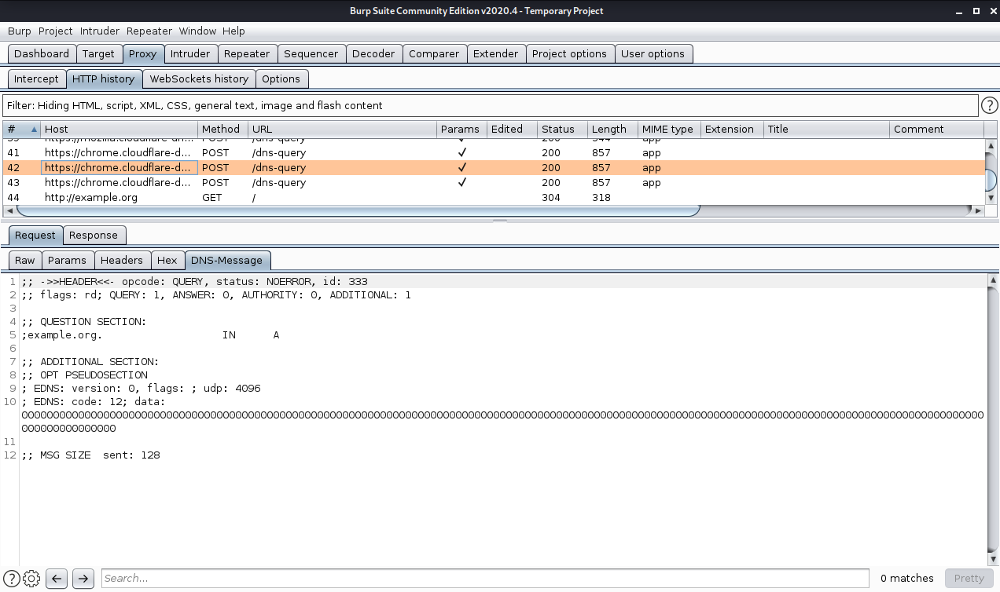
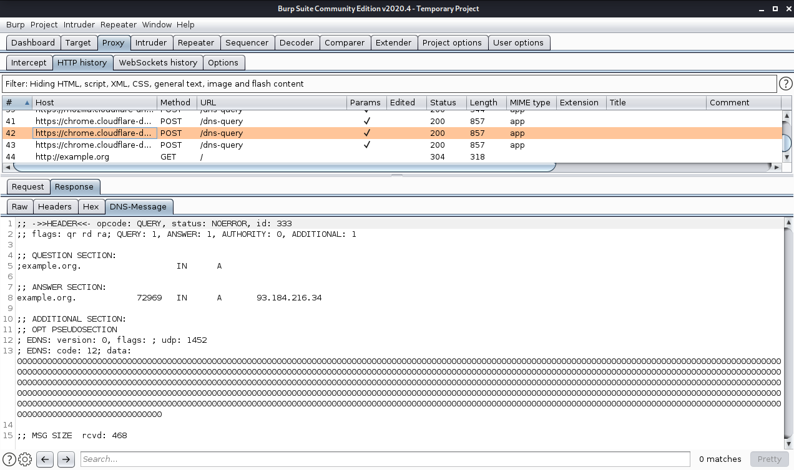

# Burp DoH Decoder

Decodes DNS messages from HTTP(S) requests and responses with the MIME type `application/dns-message`

## Getting Started

### Install Burp DoH Decoder

1. Go to your desired extension installation directory and run the following commands. 
    ```sh
    git clone https://github.com/DNS-Privacy-Security/burp-doh-decoder.git
    pip install -r burp-doh-decoder/requirements.txt --target=burp-doh-decoder/packages
    ```

2. If not already installed, download the standalone Jython JAR file from https://www.jython.org/download and define the file location in Burp:\
Extender ➡ Options ➡ Python Environment ➡ Location of Jython standalone JAR file.

3. Add Burp DoH Decoder to the Burp extensions:\
Extender ➡ Extensions ➡ Add\
Configure the Extension Details and press Next button
    * Extension type: Python
    * Extension file: `<path/of/burp-doh-decoder.py>`

4. The Burp DoH Decoder is now installed and no errors should be visible on the Errors tab

## Configuration

You can configure Burp DoH Decoder with the `burp-doh-decoder.ini` file.

### UDP DNS Mirror

The DoH decoder can send a copy of the DNS messages over UDP for analysis with other tools like Wireshark. Every time you open a DNS Message tab in Burp, a copy of the message is sent to the destination defined in the INI file.
```ini
[UDPMIRROR]
enabled = true
ip = 127.53.53.53
port = 53
```

## Documentation

You can find the [Documentation](docs/DOCUMENTATION.md) in the docs folder.

## Screenshots

### DoH Request



### DoH Response


